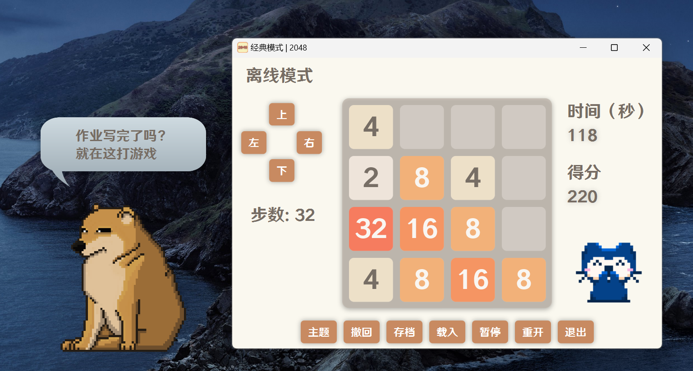
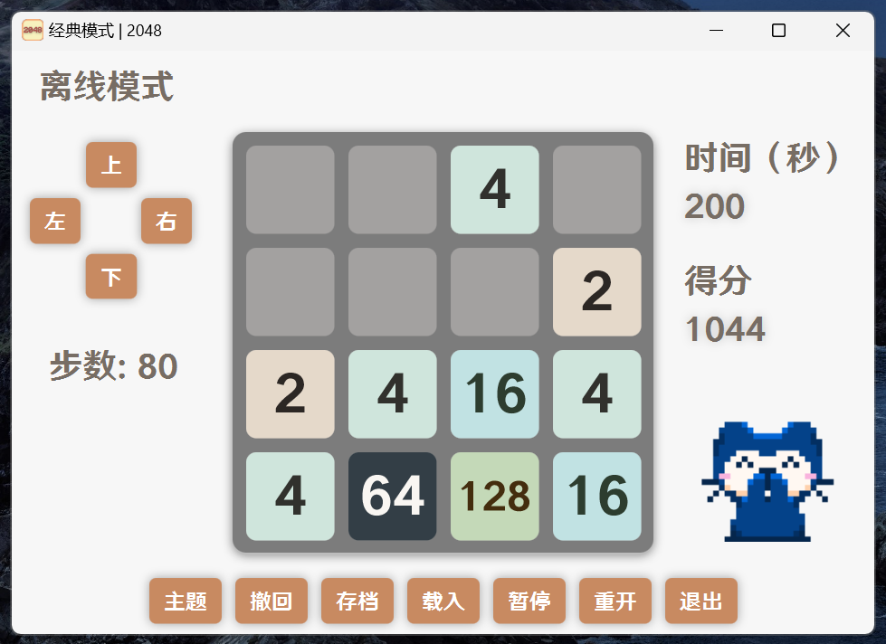
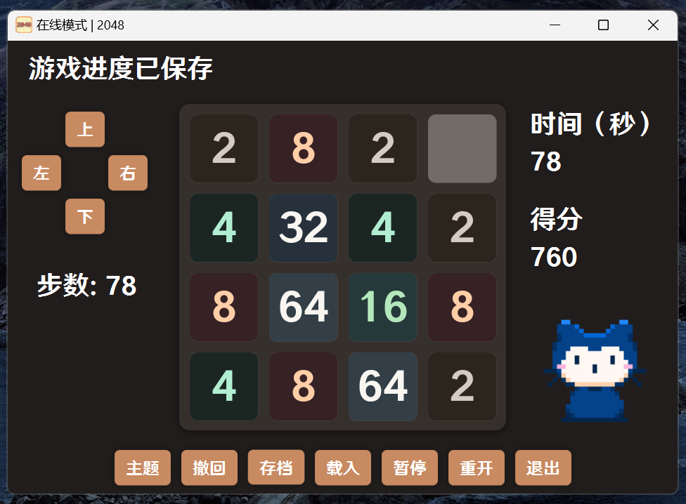
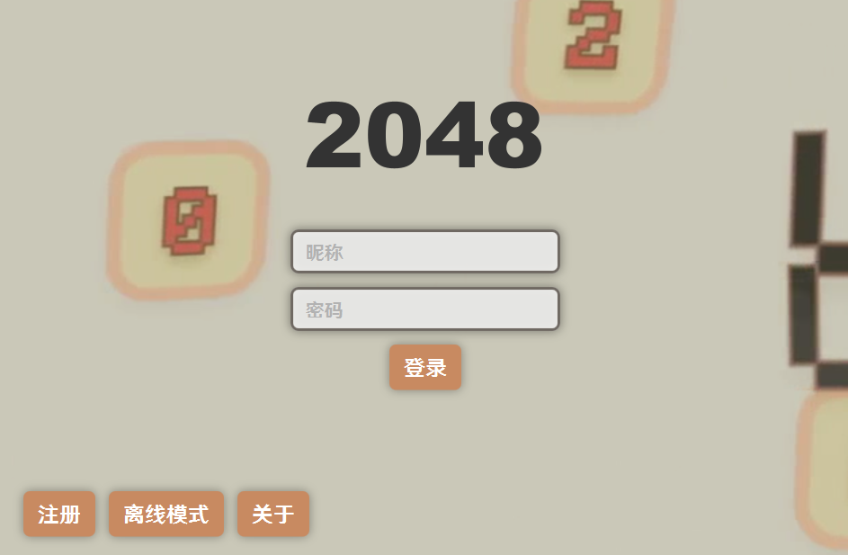

# 2048 by ura

  

    

这是 SUSTech CS109 课程大作业的项目仓库，ura 是一个由两个人组成的小队。本游戏使用 maven 作为项目管理器构建，使用 javafx 作为图形库。

本项目 GUI 由 FXML 实现。使用序列化技术保存游戏状态和用户信息。使用 WebSocket 通信技术实现多人游戏。

## 项目结构

本项目使用 MVC 结构。项目结构如下：

```angular2html
src
├── main
│   ├── java
│   │   └── devproject
│   │       ├── controller
│   │       ├── model
│   │       ├── server
│   │       ├── view
│   │       └── GameLauncher.java 程序入口
│   └── resources
│       ├── css
│       ├── fxml
│       ├── images
│       └── sounds
└── test
└── java
└── devproject
└── model
```
## 屏幕截图








[2024-06-05 21-49-06.mkv](src/main/resources/Assets/2024-06-05%2021-49-06.mkv)

## 功能

### 游戏模式

- 经典模式：原始的2048游戏模式，目标是创建一个2048的瓦片。
- 障碍模式：在游戏板上添加障碍，增加游戏难度。
- 时间模式：在限定的时间内尽可能得到高分。

### 游戏操作

- 使用键盘上的箭头键来移动瓦片。当两个相同的瓦片碰到时，它们会合并成一个！
- 撤销功能：可以回溯至少5步。
- 存档功能：注册用户可以存档，离线用户无法存档。（存档用户退出客户端后，还可以读档）

### 在线功能

- 排行榜：查看所有玩家的得分排名。
- 多人游戏：通过WebSocket实现多人在线同步游戏。

### 账号管理

- 用户注册和登录：用户可以创建自己的账号，账号密码使用BASE_64加密。
- 用户信息管理：用户可以查看和修改自己的信息。
- 用户可以在线存档，存档使用BASE_64加密。

### 图形用户界面

- 游戏界面：使用JavaFX创建的图形用户界面，包括游戏板块和得分显示。
- 主题皮肤：提供多种游戏主题皮肤供玩家选择。
- 德芙劲敌：丝滑的动画！

### 音效和音乐

- 游戏音效：移动瓦片和合并瓦片时的音效。
- 背景音乐：在游戏过程中播放的背景音乐，可以在设置中开启或关闭。

### AI助手

- AI助手：提供AI助手帮助玩家进行游戏，可以在设置中开启或关闭。AI使用蒙特卡洛树状搜索（但是效果可能不咋的）。

### 版本管理
使用 git 进行版本管理。

## 系统要求

**Windows PC**
- Windows11/10/8/7/Vista
- Core2Duo 2.4Ghz
- 8 GB RAM
- 100MB available space

**Mac**
- macOS 10.12
- Apple silicon M1
- 8 GB RAM